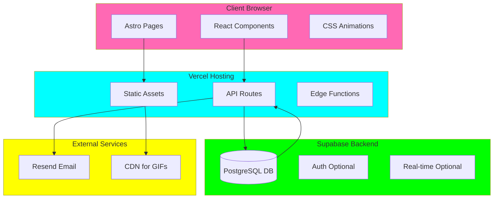
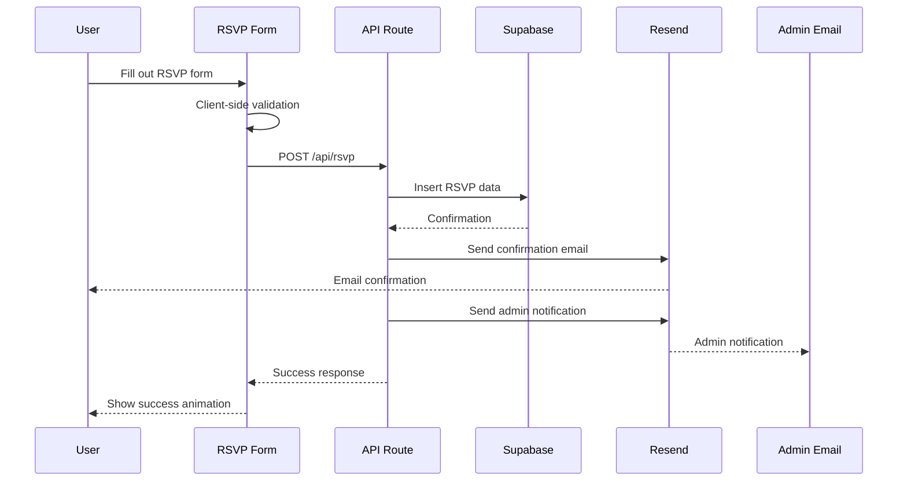
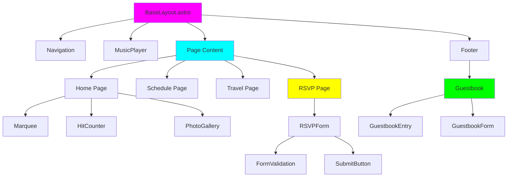
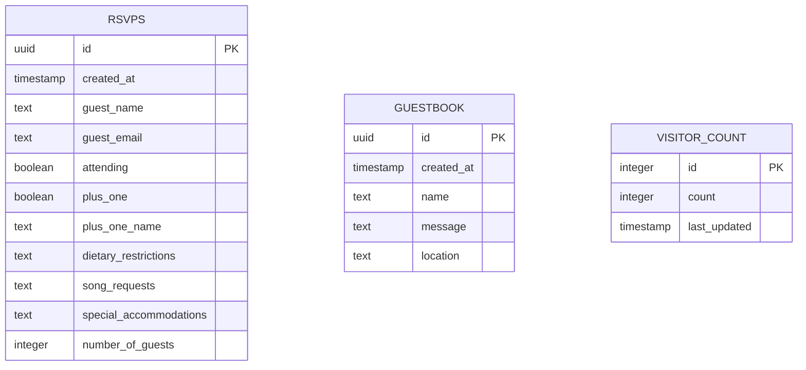

# 🏗️ Wedding Website Architecture

## System Architecture Diagram



## Data Flow: RSVP Submission



## Component Hierarchy



## Database Schema Relationships



## File Structure

```
rachelandtim-dot-fun/
├── src/
│   ├── pages/
│   │   ├── index.astro           # Home page
│   │   ├── schedule.astro        # Schedule page
│   │   ├── travel.astro          # Travel page
│   │   ├── rsvp.astro            # RSVP page
│   │   └── api/
│   │       ├── rsvp.ts           # RSVP submission
│   │       ├── guestbook.ts      # Guestbook API
│   │       └── counter.ts        # Visitor counter
│   │
│   ├── components/
│   │   ├── react/
│   │   │   ├── HitCounter.tsx
│   │   │   ├── Marquee.tsx
│   │   │   ├── RainbowDivider.tsx
│   │   │   ├── RSVPForm.tsx
│   │   │   ├── Guestbook.tsx
│   │   │   ├── MusicPlayer.tsx
│   │   │   ├── BlinkingText.tsx
│   │   │   └── GeoButton.tsx
│   │   │
│   │   └── astro/
│   │       ├── BaseLayout.astro
│   │       ├── Navigation.astro
│   │       └── Footer.astro
│   │
│   ├── styles/
│   │   ├── global.css            # Global styles
│   │   ├── geocities.css         # Geocities theme
│   │   └── animations.css        # CSS animations
│   │
│   ├── lib/
│   │   ├── supabase.ts           # Supabase client
│   │   ├── resend.ts             # Resend client
│   │   └── utils.ts              # Utility functions
│   │
│   └── assets/
│       ├── images/
│       │   ├── gifs/             # Animated GIFs
│       │   ├── backgrounds/      # Tiled backgrounds
│       │   └── icons/            # Icons and graphics
│       │
│       └── audio/
│           └── wedding.mid       # MIDI background music
│
├── public/
│   ├── fonts/                    # Web fonts
│   └── favicon.ico
│
├── supabase/
│   └── migrations/
│       └── 001_initial_schema.sql
│
├── .env.example
├── astro.config.mjs
├── package.json
├── tsconfig.json
├── vercel.json
├── PLAN.md
└── ARCHITECTURE.md
```

## API Endpoints Specification

### POST `/api/rsvp`

**Request Body:**

```typescript
{
  guest_name: string;
  guest_email: string;
  attending: boolean;
  plus_one: boolean;
  plus_one_name?: string;
  dietary_restrictions?: string;
  song_requests?: string;
  special_accommodations?: string;
  number_of_guests: number;
}
```

**Response:**

```typescript
{
  success: boolean;
  message: string;
  id?: string;
}
```

### GET `/api/guestbook`

**Response:**

```typescript
{
  entries: Array<{
    id: string;
    created_at: string;
    name: string;
    message: string;
    location?: string;
  }>;
}
```

### POST `/api/guestbook`

**Request Body:**

```typescript
{
  name: string;
  message: string;
  location?: string;
}
```

### GET `/api/counter`

**Response:**

```typescript
{
  count: number;
}
```

### POST `/api/counter`

**Response:**

```typescript
{
  count: number;
}
```

## Security Considerations

1. **Rate Limiting**: Implement on all API routes
2. **Input Validation**: Sanitize all user inputs
3. **CORS**: Configure for production domain
4. **Environment Variables**: Never commit secrets
5. **Supabase RLS**: Row Level Security policies
6. **Email Validation**: Verify email format
7. **Spam Protection**: Consider honeypot fields

## Performance Optimizations

1. **Image Optimization**: Use Astro's image component
2. **Lazy Loading**: Load GIFs on scroll
3. **Code Splitting**: React components on demand
4. **Caching**: Cache visitor count for 5 minutes
5. **CDN**: Serve static assets from CDN
6. **Minification**: CSS and JS minification
7. **Preloading**: Critical fonts and assets

## Accessibility Features

1. **Skip to Content**: Link for screen readers
2. **Alt Text**: All images and GIFs
3. **ARIA Labels**: Form inputs and buttons
4. **Keyboard Navigation**: Full keyboard support
5. **Music Controls**: Easy pause/mute
6. **Color Contrast**: Readable text (where possible)
7. **Focus Indicators**: Visible focus states

---

Ready to bring this chaotic masterpiece to life! 🎨✨
